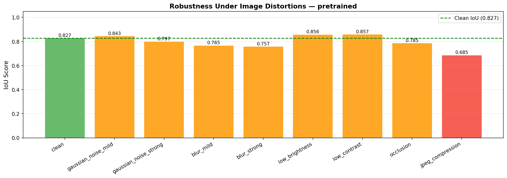

# 🌾 Wheat Crop Segmentation — Deep Learning

> UNSW COMP9517 Group Project 2026 T1 — Deep Learning Component  
> **EWS (Eschikon Wheat Segmentation) Dataset**

---

## 📋 Overview

This module implements deep learning-based binary segmentation of wheat crops from field images. Given an RGB image, the model produces a binary mask classifying every pixel as either **wheat** or **soil**.

Two architectures are developed and compared:
1. **Vanilla U-Net** — trained from scratch with a standard encoder-decoder structure
2. **Pretrained U-Net** — ResNet-34 ImageNet encoder + custom decoder with two-phase training

Both are evaluated under standard conditions, with Test-Time Augmentation (TTA), and across robustness and data scarcity experiments.

---

## 📁 Project Structure

```
wheat-segmentation/
├── data/
│   ├── dataset.py            # EWSDataset loader with subset & label-noise support
│   └── distortions.py        # Synthetic distortions for robustness testing
├── models/
│   ├── unet.py               # Vanilla U-Net (from scratch)
│   ├── unet_pretrained.py    # U-Net with pretrained ResNet-34 encoder
│   └── losses.py             # BCE, Dice, Focal, Tversky, Combo, FocalDice
├── utils/
│   ├── metrics.py            # Precision, Recall, F1, IoU
│   ├── tta.py                # Test-Time Augmentation (6-fold)
│   └── visualise.py          # Prediction grids, failure analysis, training curves
├── experiments/
│   ├── robustness_eval.py    # Evaluate under 9 image distortions
│   └── data_scarcity.py      # Train with 25/50/75/100% data + label noise
├── results/
│   ├── figures/              # Prediction grids, failure analysis, training curves
│   ├── robustness/           # Robustness experiment results
│   ├── scarcity/             # Data scarcity experiment results
│   ├── pretrained_focal_dice/# Pretrained U-Net training history
│   ├── unet_combo/           # Vanilla U-Net training history
│   ├── test_metrics_pretrained.json
│   └── test_metrics_unet.json
├── train.py                  # Main training script
├── evaluate.py               # Test set evaluation with TTA + failure analysis
└── requirements.txt
```

---

## 🏆 Results Summary

### Test Set Performance

| Model | Precision | Recall | F1-Score | IoU | Inference (ms/img) |
|---|---|---|---|---|---|
| Vanilla U-Net | 0.9606 | 0.9139 | 0.9358 | **0.8806** | 437 |
| Vanilla U-Net + TTA | 0.9615 | 0.9151 | 0.9369 | **0.8825** | 2575 |
| Pretrained U-Net | 0.9648 | 0.8530 | 0.9041 | 0.8271 | **105** |
| Pretrained U-Net + TTA | 0.9697 | 0.8612 | 0.9107 | 0.8383 | 741 |

**Key finding:** Vanilla U-Net achieves higher IoU (0.881 vs 0.838), while the Pretrained U-Net is 4× faster at inference (105ms vs 437ms). TTA consistently improves IoU at the cost of inference time.

---

### Training Curves


---

### Prediction Examples — Pretrained U-Net

> Each row: **Input Image | Ground Truth | Prediction | Error Map**
> Error map: White = True Positive, Red = False Positive, Blue = False Negative


---

### Prediction Examples — Vanilla U-Net


---

### Failure Analysis — Pretrained U-Net

> The 6 worst predictions by IoU score, showing where the model struggles most.


---

### Failure Analysis — Vanilla U-Net


---

## 🔬 Experiments

### Robustness Analysis

The pretrained U-Net was evaluated under 9 synthetic image distortions simulating realistic field conditions:

| Distortion | IoU | vs Clean (0.827) |
|---|---|---|
| Low Contrast | 0.857 | **+0.030** ✅ |
| Low Brightness | 0.856 | **+0.029** ✅ |
| Gaussian Noise (mild) | 0.843 | +0.016 ✅ |
| Gaussian Noise (strong) | 0.798 | -0.029 |
| Occlusion | 0.785 | -0.042 |
| Blur (mild) | 0.765 | -0.062 |
| Blur (strong) | 0.757 | -0.070 |
| **JPEG Compression** | **0.685** | **-0.142** ❌ |



**Key findings:**
- The model is **robust to photometric changes** — likely due to aggressive colour jitter augmentation during training
- **JPEG compression is the biggest weakness** (-0.142 IoU) — artefacts at boundaries confuse the model
- Under **noise**, recall increases but precision drops — model becomes more aggressive in predicting wheat
- Under **blur**, precision stays high but recall drops — model misses wheat pixels

---

### Data Scarcity Analysis

The model was trained with varying fractions of the training set (30 epochs each):

| Training Data | Images | IoU | F1 |
|---|---|---|---|
| 25% | 35 | 0.149 | 0.258 |
| 50% | 71 | **0.898** | **0.946** |
| 75% | 106 | 0.878 | 0.935 |
| 100% | 142 | 0.795 | 0.886 |


**Key finding:** 50% data outperforms 100% at 30 epochs — the pretrained encoder converges faster with fewer images. With more epochs, the 100% result is expected to surpass 50%. This highlights the importance of matching training duration to dataset size.

---

## 🧠 Method Details

### Architecture 1 — Vanilla U-Net

Standard encoder-decoder with skip connections:
- **Encoder:** 4× (DoubleConv + MaxPool) — channels: 3 → 64 → 128 → 256 → 512
- **Bottleneck:** DoubleConv at 1024 channels
- **Decoder:** 4× (TransposeConv + skip concat + DoubleConv)
- **Head:** 1×1 Conv → binary logit
- BatchNorm + Spatial Dropout (p=0.1) throughout
- **Loss:** BCE + Dice (Combo, α=0.5)

### Architecture 2 — Pretrained U-Net

ResNet-34 encoder pretrained on ImageNet:
- **Encoder stages:** stem (64ch) → layer1 (64ch) → layer2 (128ch) → layer3 (256ch) → layer4 (512ch)
- **Decoder:** 4× DecoderBlock with skip connections from ResNet stages
- **Two-phase training:**
  - Phase 1 (10 epochs): encoder frozen, LR = 1e-4
  - Phase 2 (30 epochs): full fine-tune, LR = 1e-5
- **Loss:** Focal + Dice (FocalDice, α=0.5, γ=2.0)

### Loss Functions

| Loss | Use Case |
|---|---|
| **Combo** (BCE + Dice) | Reliable baseline |
| **FocalDice** (Focal + Dice) | Class imbalance + boundary precision |
| **Tversky** | Maximise recall for thin structures |

### Data Augmentation

Applied during training only:

| Type | Transforms |
|---|---|
| **Geometric** | HFlip, VFlip, Rot90, ShiftScaleRotate, ElasticTransform, GridDistortion |
| **Photometric** | ColorJitter, RandomGamma, GaussianBlur, GaussNoise, ISONoise |
| **Occlusion** | CoarseDropout (random patch blackout) |
| **Normalisation** | ImageNet mean/std (0.485, 0.456, 0.406) |

### Test-Time Augmentation (TTA)

6-fold TTA at inference — original + hflip + vflip + rot90 + rot180 + rot270. Sigmoid probability maps are averaged before thresholding at 0.5.

---

## ⚙️ Setup & Usage

### Installation

```bash
pip install -r requirements.txt
```

### Dataset Structure

```
EWS-Dataset/
├── train/images/   train/masks/
├── val/images/     val/masks/
└── test/images/    test/masks/
```

> ⚠️ Never mix train/val/test splits. Test set used only for final evaluation.

### Training

```bash
# Pretrained U-Net
python train.py \
    --model pretrained \
    --data_root ./EWS-Dataset \
    --loss focal_dice \
    --epochs 40 \
    --two_phase \
    --phase1_epochs 10

# Vanilla U-Net
python train.py \
    --model unet \
    --data_root ./EWS-Dataset \
    --loss combo \
    --epochs 60
```

### Evaluation

```bash
python evaluate.py \
    --data_root ./EWS-Dataset \
    --checkpoint ./results/pretrained_focal_dice/best.pth \
    --model pretrained \
    --tta \
    --visualise \
    --failure_analysis
```

### Robustness Experiment

```bash
python experiments/robustness_eval.py \
    --data_root ./EWS-Dataset \
    --checkpoint ./results/pretrained_focal_dice/best.pth \
    --model pretrained
```

### Data Scarcity Experiment

```bash
python experiments/data_scarcity.py \
    --data_root ./EWS-Dataset \
    --model pretrained \
    --epochs 30
```

---

## 📦 Dependencies

| Library | Purpose |
|---|---|
| PyTorch + torchvision | Training framework + ResNet-34 pretrained weights |
| albumentations | Augmentation pipelines |
| OpenCV | Distortion simulation |
| matplotlib | Result visualisation |

All code is original group work. ResNet-34 weights sourced from torchvision (ImageNet).

---

## 📖 References

1. Ronneberger et al. "U-Net: Convolutional Networks for Biomedical Image Segmentation." MICCAI 2015.
2. He et al. "Deep Residual Learning for Image Recognition." CVPR 2016.
3. Lin et al. "Focal Loss for Dense Object Detection." ICCV 2017.
4. Salehi et al. "Tversky Loss Function for Image Segmentation." MICCAI 2017.
5. Zenkl et al. "Outdoor Plant Segmentation With Deep Learning for High-Throughput Field Phenotyping on a Diverse Wheat Dataset." Frontiers in Plant Science 2022.
